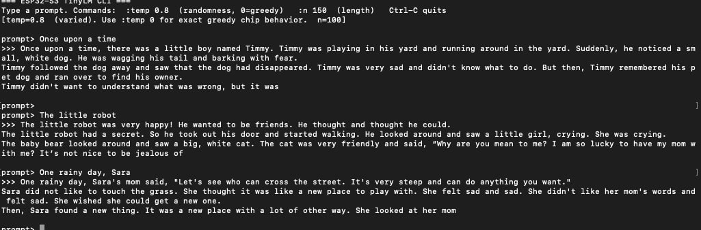
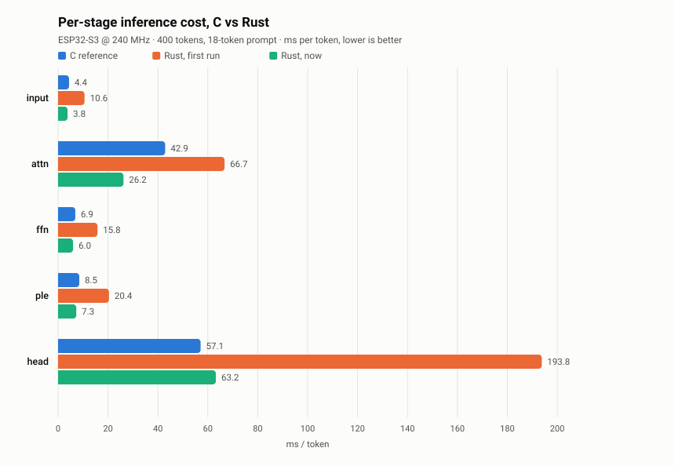

# esp32-tinyLLM

**A 28.9M-parameter language model running on an $8 microcontroller — rewritten in Rust.**

The ESP32-S3 has 512 KB of SRAM. This model has 28.9M parameters. It fits because
~25M of them live in a flash-mapped Per-Layer Embedding table (Gemma 3n's trick,
three orders of magnitude down) and the rest are 4-bit quantized. It writes short
stories at 9.4 tok/s — see the measured table below.

This repo is a ground-up Rust port of the inference engine, ported function for
function from [slvDev/esp32-ai](https://github.com/slvDev/esp32-ai)'s C
implementation — with every step checked against the C version's own output.



It writes children's stories — it cannot answer questions or follow instructions,
which is the point: it's small enough to run on a microcontroller.

## Quick start

No hardware needed for any of this:

```bash
# run the test suite (verifies Rust against the C reference)
cd engine/llm-host && cargo test --release

# chat with the model on your laptop
cd demo && sh run_cli.sh

# time the two engines against each other
scripts/bench_host.py
```

On a board: `cd engine/llm-firmware && cargo run --release`.

## Status

| Phase | What | State |
|---|---|---|
| 1 | `llm-core` — portable `no_std` model math | done, parity-verified |
| 2 | `llm-host` — CLI tools + correctness tests | done, parity-verified |
| 3 | `llm-firmware` — on-device build | runs on real hardware; closing the perf gap |
| 4 | `llm-display` — optional OLED/TFT screen | not started |
| 5–6 | `bandwidth_bench` port; drop FreeRTOS for `esp-hal` | not started |

### C vs Rust, measured on hardware

<picture>
  <source media="(prefers-color-scheme: dark)" srcset="./png/benchmark-stages-dark.svg">
  
</picture>

Both firmwares emit **byte-identical text** — same 400 tokens, cut off at the same
word. Every stage is now faster than C, the output head included. The board proves it rather than being taken at its word: it folds every
token id it emits into a digest and prints it, and
[`model/models.toml`](./model/models.toml) pins the value that
`llm-host/tests/token_stream_digest.rs` recomputes on the host. A run that
diverges by one token says so, loudly, in the same output as the timings — and
a firmware that is fast because it computes something else is not a result.

<!-- BEGIN device-table (generated: scripts/plot_stages.py --inject) -->

| ms/token | input | attn | ffn | ple | head | stages | **wall** | tok/s |
|---|---|---|---|---|---|---|---|---|
| **C reference** | 4.4 | 42.9 | 6.9 | 8.5 | 57.1 | 119.8 | **122.0** | 8.20 |
| **Rust, first run** | 10.6 | 66.7 | 15.8 | 20.4 | 193.8 | 307.3 | **311.5** | 3.21 |
| **+ dual-core head, unroll** | 8.0 | 58.9 | 11.8 | 15.1 | 110.9 | 204.7 | **208.8** | 4.79 |
| **+ wider caches** | 7.4 | 53.7 | 11.2 | 14.3 | 87.6 | 174.2 | **177.3** | 5.64 |
| **Rust, before** | 7.8 | 54.4 | 11.9 | 15.2 | 94.6 | 183.9 | **187.2** | 5.34 |
| **Rust, nibble LUT** | 6.6 | 50.8 | 10.1 | 12.7 | 98.0 | 178.2 | **181.6** | 5.51 |
| **Rust, + KV layout** | 6.6 | 47.0 | 10.1 | 12.7 | 94.8 | 171.2 | **174.6** | 5.73 |
| **+ int4 head** | 6.6 | 47.0 | 10.1 | 12.7 | 94.8 | 171.2 | **174.6** | 5.73 |
| **+ 4 accumulators** | 6.6 | 47.0 | 10.1 | 12.7 | 81.3 | 157.7 | **161.0** | 6.21 |
| **+ bias hoist** | 6.6 | 47.0 | 10.1 | 12.7 | 61.5 | 137.9 | **140.9** | 7.09 |
| **+ dual-core matvec** | 3.9 | 40.2 | 6.2 | 7.5 | 61.6 | 119.4 | **122.7** | 8.15 |
| **+ argmax/stdout** | 3.8 | 39.8 | 6.0 | 7.3 | 61.5 | 118.4 | **121.1** | 8.25 |
| **+ argmax in head** | 3.9 | 40.0 | 6.1 | 7.5 | 61.5 | 119.0 | **119.0** | 8.40 |
| **+ attn instrumented** | 3.9 | 39.0 | 6.2 | 7.6 | 61.9 | 118.6 | **118.5** | 8.43 |
| **+ attn heads split** | 3.9 | 26.4 | 6.2 | 7.6 | 62.7 | 106.8 | **106.8** | 9.36 |
| **+ token digest** | 3.9 | 26.3 | 6.2 | 7.6 | 62.3 | 106.3 | **106.3** | 9.41 |
| **+ MSPI bus 120 MHz** ‡ | 3.6 | 24.5 | 5.7 | 7.0 | 62.1 | 102.9 | **102.9** | 9.71 |
| **+ int8 head (reverted)** ‡ | 4.0 | 26.8 | 6.2 | 7.6 | 76.9 | 121.5 | **121.6** | 8.23 |
| **+ probe, always on** ‡ | 3.8 | 26.2 | 6.0 | 7.3 | 63.2 | 106.5 | **106.6** | 9.38 |
| **+ probe opt-in** | 3.9 | 26.3 | 6.2 | 7.6 | 62.2 | 106.2 | **106.3** | 9.41 |
| **Rust, --fast-mspi** ‡ | 3.8 | 24.7 | 6.0 | 7.3 | 60.9 | 102.7 | **102.6** | 9.75 |
| **+ i16 activations** | 3.9 | 26.8 | 6.2 | 7.7 | 55.3 | 99.9 | **100.0** | 10.00 |
| **Rust, now** | 4.0 | 27.1 | 6.5 | 7.9 | 49.7 | 95.2 | **95.2** | 10.50 |
| ratio vs C reference | 0.91x | 0.63x | 0.94x | 0.93x | 0.87x | 0.79x | **0.78x** | |
| absolute gap | -0.4 | -15.8 | -0.4 | -0.6 | -7.4 | -24.6 | **-26.8** | |
| **change this brought** | +0.1 | +0.3 | +0.3 | +0.2 | -5.6 | -4.7 | **-4.8** | |

‡ **+ MSPI bus 120 MHz is not the shipping configuration** and is excluded from the ratios and the summary below. Requires CONFIG_IDF_EXPERIMENTAL_FEATURES; Espressif documents 120 MHz as temperature-sensitive and not recommended across the industrial range, and this board's boya flash part refused it and fell back. Real, reproducible, bit-exact -- and not what you get by cloning this repo. Available as a +3.3% opt-in; see BENCHMARKING.md.
‡ **+ int8 head (reverted) is not the shipping configuration** and is excluded from the ratios and the summary below. A negative result, kept because it corrects a claim this file made. Staging the head as unpacked int8 instead of packed int4 -- the C reference's format, and one fewer operation per element -- made the head 62.3 -> 76.9 ms and the token 106.3 -> 121.5. Reverted. Bit-exact throughout: the digest still printed OK, so this is purely a cost.
‡ **+ probe, always on is not the shipping configuration** and is excluded from the ratios and the summary below. Superseded by [run.rust-findings-off]. Kept because it is the measurement that justified making the probe opt-in: identical arithmetic, 0.3 ms slower, purely from ~50 lines sitting in head.rs.
‡ **Rust, --fast-mspi is not the shipping configuration** and is excluded from the ratios and the summary below. One flag from the default build -- scripts/run_device.sh --fast-mspi -- and not the default, for reasons about other boards rather than this one: CONFIG_IDF_EXPERIMENTAL_FEATURES, Espressif documenting 120 MHz as temperature-sensitive, and this board's boya flash part refusing it and falling back. Bit-exact: 102.6 ms/token, 9.75 tok/s, 18.9% faster than the C reference, digest 0x327578cb136fd6aa OK.

**`attn` broken down** — the sub-stages the five-stage profile hides. `qkv`/`proj` are the fp32 matvec that also drives `ffn` and `ple`; `core` is attention proper, the only part that grows with sequence position. The C reference has no equivalent instrumentation, so it is absent rather than zero.

| attn ms/token | qkv | rope | core | proj | sum | both cores |
|---|---|---|---|---|---|---|
| **+ attn instrumented** | 7.8 | 0.14 | 28.3 | 2.7 | 38.9 | `qkv`, `proj` |
| **+ attn heads split** | 7.9 | 0.15 | 15.6 | 2.7 | 26.3 | `qkv`, `proj`, `core` |
| **+ token digest** | 7.8 | 0.15 | 15.6 | 2.7 | 26.2 | `qkv`, `proj`, `core` |
| **+ MSPI bus 120 MHz** | 7.2 | 0.15 | 14.7 | 2.5 | 24.6 | `qkv`, `proj`, `core` |
| **+ int8 head (reverted)** | 7.9 | 0.15 | 16.0 | 2.7 | 26.8 | `qkv`, `proj`, `core` |
| **+ probe, always on** | 7.6 | 0.15 | 15.9 | 2.6 | 26.2 | `qkv`, `proj`, `core` |
| **+ probe opt-in** | 7.8 | 0.15 | 15.6 | 2.7 | 26.2 | `qkv`, `proj`, `core` |
| **Rust, --fast-mspi** | 7.5 | 0.15 | 14.5 | 2.6 | 24.8 | `qkv`, `proj`, `core` |
| **+ i16 activations** | 7.9 | 0.15 | 16.0 | 2.7 | 26.8 | `qkv`, `proj`, `core` |
| **Rust, now** | 8.2 | 0.15 | 15.8 | 2.9 | 27.0 | `qkv`, `proj`, `core` |

**Rust is 28.2% faster per token than the C reference it was ported from** — 95.2 ms against 122.0, 10.50 tok/s against 8.20, on the same board with byte-identical output. It beats C on 5 of the 5 stages.

<!-- END device-table -->

The `stages` column is the profiled sum and `wall` is what a user experiences.
They differ by whatever runs outside the profiled stages: 2.2 ms/token for the
C reference, 0.03 for Rust since the greedy pick moved into the head.

Everything above — table, sentence and chart — is measured on hardware and
generated from [`benchmarks/device.toml`](./benchmarks/device.toml) by
`scripts/plot_stages.py`, so a re-measurement updates all of them together and
they cannot drift apart. Add a run, re-run the script; never hand-edit a figure
here. Methodology and per-lever detail: [BENCHMARKING.md](./BENCHMARKING.md).

### Correctness

Correctness is enforced by tests, not by inspection: golden logits vs PyTorch,
byte-identical CLI output vs the compiled C binary, and cross-entropy over real
validation tokens — all six gates are described in
[`engine/llm-host/tests/README.md`](./engine/llm-host/tests/README.md).

Two real bugs were caught that way during the port: an out-of-bounds scratch
buffer for one model config, and a rounding-mode mismatch against C's `lrintf`.
Both fixed.

## Docs

| | |
|---|---|
| [BENCHMARKING.md](./BENCHMARKING.md) | how the numbers were measured, and what to optimize next |
| [ROADMAP.md](./ROADMAP.md) | what to do next, in order, and what's still unexplained |
| [TRAINING.md](./TRAINING.md) | how `model.bin` was made — dataset → training → 4-bit PTQ → export |
| [CONTRIBUTING.md](./CONTRIBUTING.md) | ground rules, and how to run the parity tests |

Reading the code: [`MIGRATION_PLAN.md`](./MIGRATION_PLAN.md) for why the port is
shaped this way, then `engine/llm-core/src/tensor.rs` and `model.rs` for the
ported math, then `engine/llm-host/tests/`. The model itself, its provenance and
how to add another: [`model/README.md`](./model/README.md).

## Repo layout

```
engine/            the Rust workspace
  llm-core/          no_std, platform-agnostic model math
  llm-host/          CLI tools + correctness tests
  llm-firmware/      on-device build (needs ESP-IDF + hardware)
  llm-display/       optional demo screen (not started)
model/             trained models, one folder per registry entry, + models.toml
reference-c/       the C engine this port is checked against (build fixes only)
training/          the Python training pipeline, vendored for reference
demo/              interactive CLI over either engine
scripts/           model.sh (registry reader), bench_host.py
```

[`model/models.toml`](./model/models.toml) is the registry: it names model files,
benchmark settings, and expected parity values *once*, and both languages read it
— Rust via `llm_host::manifest`, C-side tooling via `scripts/model.sh` — so they
cannot drift apart.

## Contributing

The main open work is closing the Rust-vs-C gap. [`ROADMAP.md`](./ROADMAP.md)
sequences it — two cheap unknowns gate most of the expensive work, so start there
rather than with the SIMD items.

Also built on: [llama2.c](https://github.com/karpathy/llama2.c) (the single-file C
inference style `llm.h` follows), TinyStories (Eldan & Li 2023,
[arXiv:2305.07759](https://arxiv.org/abs/2305.07759)), and Google's Gemma 3n
Per-Layer Embeddings.

## License

Apache 2.0 for this repo's code ([LICENSE](./LICENSE)). `reference-c/` is vendored
from upstream and keeps its original MIT terms
([`reference-c/LICENSE`](./reference-c/LICENSE)).
