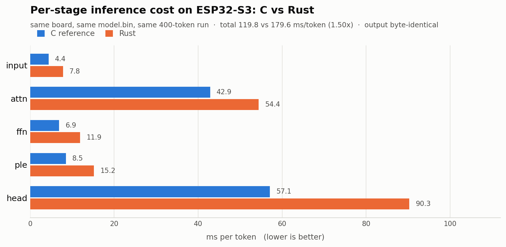

# esp32-tinyLLM

**A 28.9M-parameter language model running on an $8 microcontroller — rewritten in Rust.**

The ESP32-S3 has 512 KB of SRAM. This model has 28.9M parameters. It fits because
~25M of them live in a flash-mapped Per-Layer Embedding table (Gemma 3n's trick,
three orders of magnitude down) and the rest are 4-bit quantized. It writes short
stories at ~9.5 tok/s.

This repo is a ground-up Rust port of the inference engine, ported function for
function from [slvDev/esp32-ai](https://github.com/slvDev/esp32-ai)'s C
implementation — with every step checked against the C version's own output.


It writes children's stories — it cannot answer questions or follow instructions,
which is the point: it's small enough to run on a microcontroller.

## Quick start

No hardware needed for any of this:

```bash
# run the test suite (verifies Rust against the C reference)
cd engine/llm-host && cargo test --release

# chat with the model on your laptop
cd demo && sh run_cli.sh

# time the two engines against each other
scripts/bench_host.py
```

On a board: `cd engine/llm-firmware && cargo run --release`.

## Status

| Phase | What | State |
|---|---|---|
| 1 | `llm-core` — portable `no_std` model math | done, parity-verified |
| 2 | `llm-host` — CLI tools + correctness tests | done, parity-verified |
| 3 | `llm-firmware` — on-device build | runs on real hardware; closing the perf gap |
| 4 | `llm-display` — optional OLED/TFT screen | not started |
| 5–6 | `bandwidth_bench` port; drop FreeRTOS for `esp-hal` | not started |

### C vs Rust, measured on hardware



Both firmwares emit **byte-identical text** — same 400 tokens, cut off at the same
word. Rust is currently **1.50x slower**, and the output head is 56% of that gap.
Closing it is the main open work. Methodology and per-lever detail:
[BENCHMARKING.md](./BENCHMARKING.md).

### Correctness

Correctness is enforced by tests, not by inspection: golden logits vs PyTorch,
byte-identical CLI output vs the compiled C binary, and cross-entropy over real
validation tokens — all six gates are described in
[`engine/llm-host/tests/README.md`](./engine/llm-host/tests/README.md).

Two real bugs were caught that way during the port: an out-of-bounds scratch
buffer for one model config, and a rounding-mode mismatch against C's `lrintf`.
Both fixed.

## Documentation

| | |
|---|---|
| [BENCHMARKING.md](./BENCHMARKING.md) | how the numbers were measured, and what to optimize next |
| [ROADMAP.md](./ROADMAP.md) | what to do next, in order, and what's still unexplained |
| [MIGRATION_PLAN.md](./MIGRATION_PLAN.md) | why the port is scoped and sequenced this way |
| [TRAINING.md](./TRAINING.md) | how `model.bin` was made — dataset → training → 4-bit PTQ → export |
| [model/README.md](./model/README.md) | the model, its provenance, and how to add another |
| [CONTRIBUTING.md](./CONTRIBUTING.md) | ground rules and how to run the parity tests |

New here? Read `MIGRATION_PLAN.md`, then `engine/llm-core/src/tensor.rs` and
`model.rs` for the actual ported math, then `engine/llm-host/tests/`.

## Repo layout

```
engine/            the Rust workspace
  llm-core/          no_std, platform-agnostic model math
  llm-host/          CLI tools + correctness tests
  llm-firmware/      on-device build (needs ESP-IDF + hardware)
  llm-display/       optional demo screen (not started)
model/             trained models, one folder per registry entry, + models.toml
reference-c/       the C engine this port is checked against (build fixes only)
training/          the Python training pipeline, vendored for reference
demo/              interactive CLI over either engine
scripts/           model.sh (registry reader), bench_host.py
```

[`model/models.toml`](./model/models.toml) is the registry: it names model files,
benchmark settings, and expected parity values *once*, and both languages read it
— Rust via `llm_host::manifest`, C-side tooling via `scripts/model.sh` — so they
cannot drift apart.

## Contributing

The main open work is closing the Rust-vs-C gap. [`ROADMAP.md`](./ROADMAP.md)
sequences it — two cheap unknowns gate most of the expensive work, so start there
rather than with the SIMD items. Ground rules in
[CONTRIBUTING.md](./CONTRIBUTING.md).

## References

- [slvDev/esp32-ai](https://github.com/slvDev/esp32-ai) — the upstream C engine and Python pipeline this ports from
- [llama2.c](https://github.com/karpathy/llama2.c) — the single-file C inference style `llm.h` follows
- TinyStories — Eldan & Li (2023), [arXiv:2305.07759](https://arxiv.org/abs/2305.07759)
- Per-Layer Embeddings — Google's Gemma 3n on-device architecture

## License

Apache 2.0 for this repo's code ([LICENSE](./LICENSE)). `reference-c/` is vendored
from [slvDev/esp32-ai](https://github.com/slvDev/esp32-ai) and keeps its original
MIT terms ([`reference-c/LICENSE`](./reference-c/LICENSE)).
